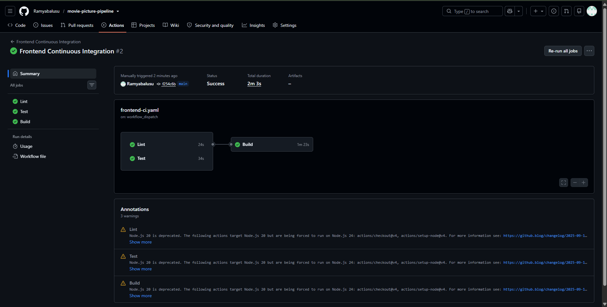
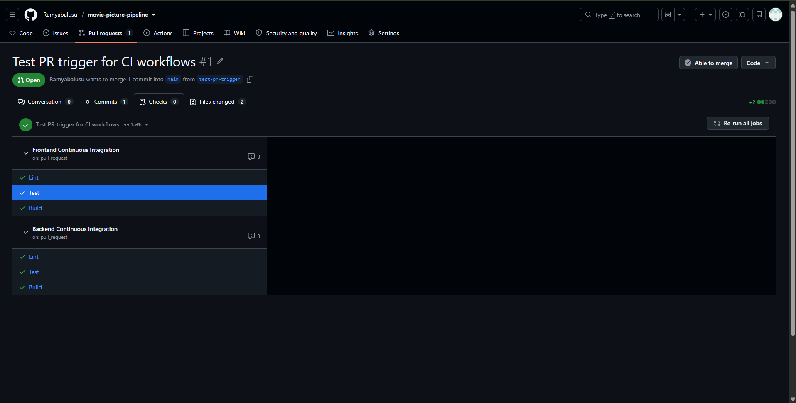
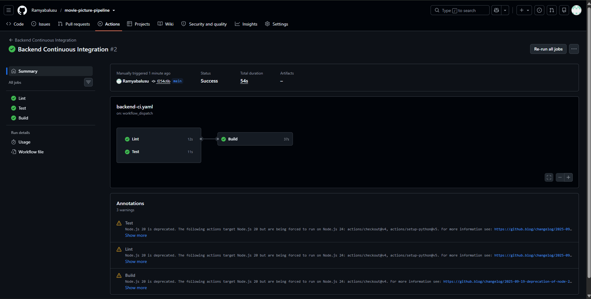
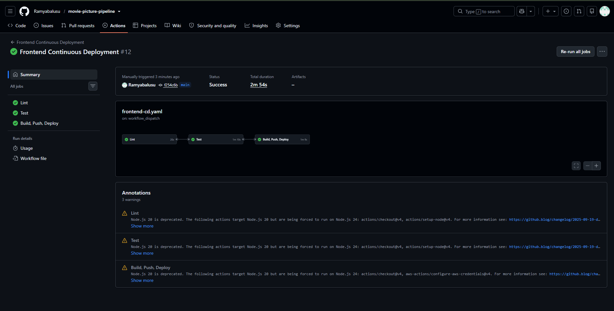
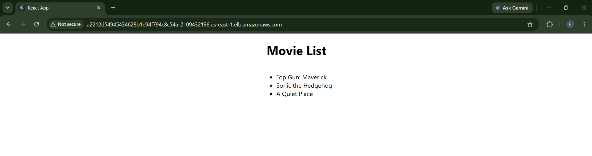
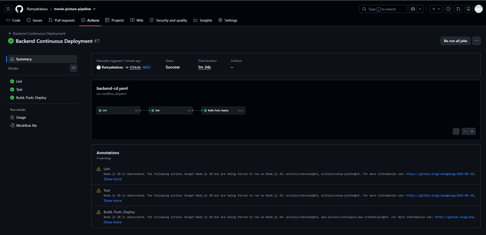
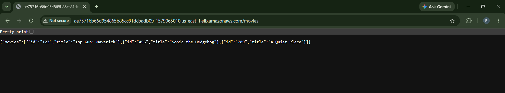
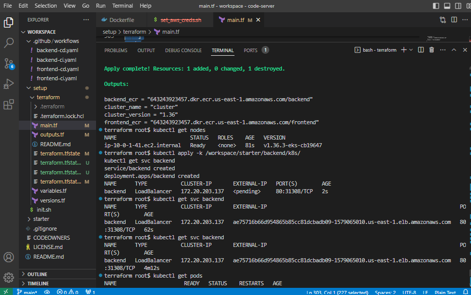
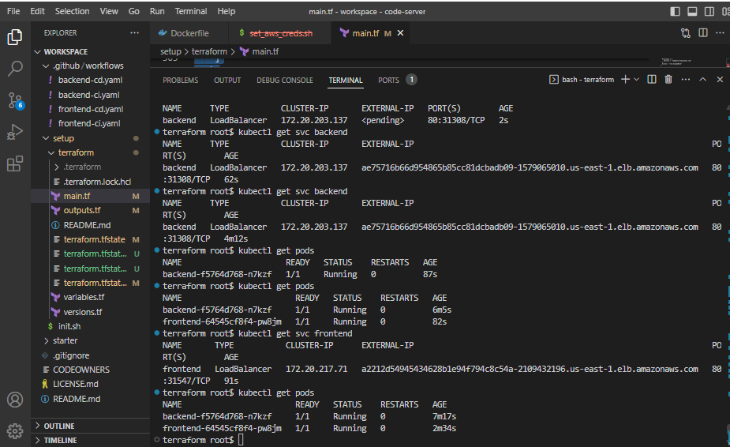

# Capstone Submission — Deploying a Microservices Application to EKS

**Repository:** https://github.com/Ramyabalusu/movie-picture-pipeline
**AWS Region:** us-east-1
**EKS Cluster Name:** cluster
**Kubernetes Version:** 1.36

---

## 1. Frontend Continuous Integration (`frontend-ci.yaml`)

**File location:** `.github/workflows/frontend-ci.yaml`

- Runs on `pull_request` to `main` (path-filtered to `starter/frontend/**`)
- Also supports manual trigger via `workflow_dispatch`
- Lint and Test jobs run independently in parallel
- Separate Build job runs only after both succeed (`needs: [lint, test]`), builds the Docker image

**Manual run — Lint and Test in parallel, Build after both succeed:**

**Triggered automatically via a Pull Request — Lint, Test, Build all passing under `on: pull_request`:**

---

## 2. Backend Continuous Integration (`backend-ci.yaml`)

**File location:** `.github/workflows/backend-ci.yaml`

- Runs on `pull_request` to `main` (path-filtered to `starter/backend/**`)
- Also supports manual trigger via `workflow_dispatch`
- Lint and Test jobs run independently in parallel
- Separate Build job runs only after both succeed (`needs: [lint, test]`), builds the Docker image

**Manual run — Lint and Test in parallel, Build after both succeed:**

**Triggered automatically via a Pull Request — see combined screenshot above (`ci-pr-trigger-both-green.png`), which shows both Frontend and Backend CI passing under `on: pull_request` in the same PR.**

---

## 3. Frontend Continuous Deployment (`frontend-cd.yaml`)

**File location:** `.github/workflows/frontend-cd.yaml`

- Runs automatically on `push` to `main`
- Also supports manual trigger via `workflow_dispatch`
- Lint → Test → Build/Push/Deploy chain (using `needs`)
- Dynamically fetches the backend's live LoadBalancer hostname from the EKS cluster and passes it as the `REACT_APP_MOVIE_API_URL` Docker build-arg
- Authenticates to ECR using `aws-actions/amazon-ecr-login@v2`, with credentials sourced from GitHub Secrets (`AWS_ACCESS_KEY_ID`, `AWS_SECRET_ACCESS_KEY`, `AWS_SESSION_TOKEN`) — no credentials hardcoded anywhere in the workflow
- Pushes image to ECR, deploys to EKS via `kubectl apply -k`

**Successful workflow run — Lint, Test, Build/Push/Deploy all green:**

**Frontend application running and displaying the movie list (confirms `REACT_APP_MOVIE_API_URL` was correctly passed and the frontend successfully calls the backend):**

**Tested URL (may expire with AWS Lab session):**
`http://a2212d54945434628b1e94f794c8c54a-2109432196.us-east-1.elb.amazonaws.com`

---

## 4. Backend Continuous Deployment (`backend-cd.yaml`)

**File location:** `.github/workflows/backend-cd.yaml`

- Runs automatically on `push` to `main`
- Also supports manual trigger via `workflow_dispatch`
- Lint → Test → Build/Push/Deploy chain (using `needs`)
- Dockerfile resolves the Alpine/GCC14 `uwsgi` compilation issue by installing `gcc`, `musl-dev`, `linux-headers`, `python3-dev` and setting `ENV CFLAGS="-Wno-error=incompatible-pointer-types"` before `pipenv install`
- Authenticates to ECR using `aws-actions/amazon-ecr-login@v2`, with credentials sourced from GitHub Secrets — no credentials hardcoded anywhere in the workflow
- Pushes image to ECR, deploys to EKS via `kubectl apply -k`

**Successful workflow run — Lint, Test, Build/Push/Deploy all green:**

**Backend `/movies` endpoint returning raw JSON directly:**

**Tested URL (may expire with AWS Lab session):**
`http://ae75716b66d954865b85cc81dcbadb09-1579065010.us-east-1.elb.amazonaws.com/movies`

---

## 5. Infrastructure (Terraform)

**Location:** `setup/terraform/`

Provisions:
- VPC with public/private subnets
- EKS Cluster (`cluster`, Kubernetes 1.36)
- EKS Managed Node Group (`udacity`)
- ECR repositories: `frontend`, `backend`
- IAM roles for EKS cluster and node group

**`terraform apply` output and `kubectl get nodes` showing a Ready node:**

**`kubectl get pods` and `kubectl get svc` showing both backend and frontend Running, with LoadBalancer external hostnames:**

---

## Security Notes

- No AWS credentials are hardcoded in any workflow file. All AWS authentication happens via `aws-actions/configure-aws-credentials@v4`, reading `AWS_ACCESS_KEY_ID`, `AWS_SECRET_ACCESS_KEY`, and `AWS_SESSION_TOKEN` from GitHub repository Secrets.
- IAM role creation for the EKS cluster and node group is handled entirely by Terraform using standard AWS managed policies (`AmazonEKSClusterPolicy`, `AmazonEKSServicePolicy`, `AmazonEKSWorkerNodePolicy`, `AmazonEKS_CNI_Policy`, `AmazonEC2ContainerRegistryReadOnly`) — no manual IAM console changes were made outside of Terraform.

---

## Known Environment Limitation

This project was built and deployed using a Udacity AWS Learner Lab (Vocareum) sandbox account, which issues short-lived, time-boxed credentials. As a result, the live URLs above may become unreachable outside of an active lab session. All required screenshots above were captured during an active session to demonstrate full functionality; the underlying `main.tf`, Dockerfiles, and workflow files in the repository are fully reproducible and will redeploy an identical, working environment in any fresh AWS sandbox session by running `terraform apply` followed by triggering the four GitHub Actions workflows.
